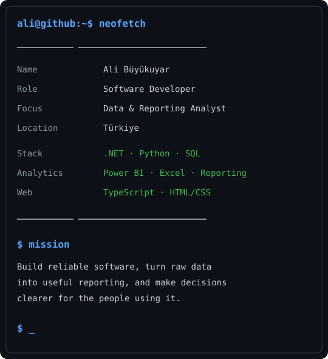

<div align="center">

```text
ali@github:~$ ./contributions.sh
```



```text
ali@github:~$ whoami
```




</div>

<br />

```text
ali@github:~$ ls skills/
```

<p align="center">
  
  
  
  
  
</p>

<div align="center">

```text
ali@github:~$ echo "Turning data into useful software and clear decisions."
```

</div>

<!-- Assets are regenerated daily by .github/workflows/update-profile-assets.yml -->
