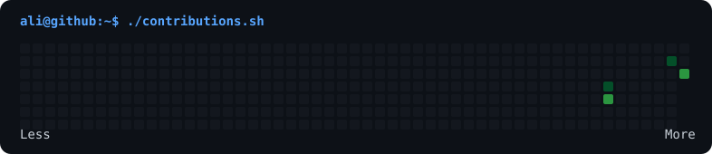

<div align="center">




```text
ali@github:~$ whoami
```

<table>
  <tr>
    <td width="280" align="center" valign="middle">
      
      <br /><br />
      <sub><b>Ali Büyükuyar</b></sub><br />
      <sub>Software Developer · Data &amp; Reporting Analyst</sub>
    </td>
    <td valign="top">
      
    </td>
  </tr>
</table>

```text
ali@github:~$ ls skills/
```

<p>
  
  
  
  
  
</p>

```text
ali@github:~$ echo "Turning data into useful software and clear decisions."
```

</div>
